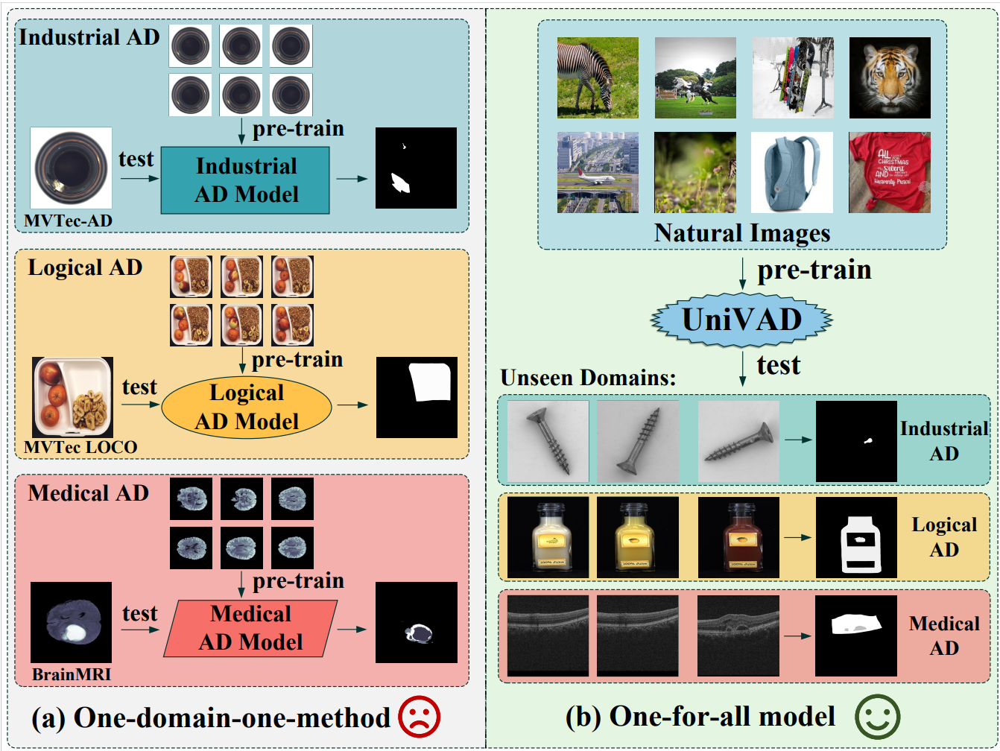
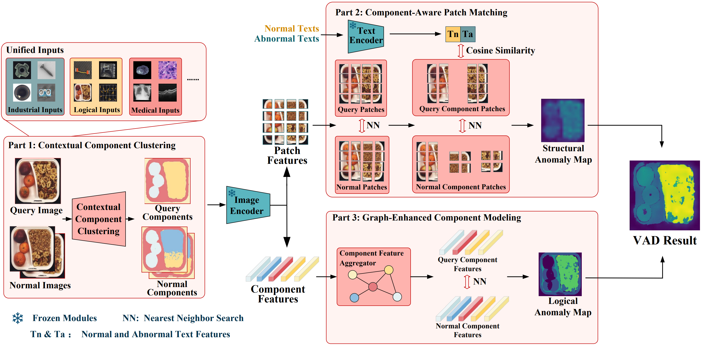

# UniVAD: A Training-free Unified Model for Few-shot Visual Anomaly Detection

Official implementation of paper [UniVAD: A Training-free Unified Model for Few-shot Visual Anomaly Detection](https://arxiv.org/abs/2412.03342) (CVPR 2025).


## Introduction
Welcome to the official repository for "UniVAD: A Training-free Unified Model for Few-shot Visual Anomaly Detection." This work presents UniVAD, a novel approach that can detect anomalies across various domains, including industrial, logical, and medical fields, using a unified model without requiring domain-specific training.

UniVAD operates by leveraging a few normal samples as references during testing to detect anomalies in previously unseen objects. It consists of three key components:

- Contextual Component Clustering ($C^3$): Segments components within images accurately by combining clustering techniques with vision foundation models.
- Component-Aware Patch Matching (CAPM): Detects structural anomalies by matching patch-level features within each component.
- Graph-Enhanced Component Modeling (GECM): Identifies logical anomalies by modeling relationships between image components through graph-based feature aggregation.
Our experiments on nine datasets spanning industrial, logical, and medical domains demonstrate that UniVAD achieves state-of-the-art performance in few-shot anomaly detection tasks, outperforming domain-specific models and establishing a new paradigm for unified visual anomaly detection.



## Overview of UniVAD


## Runing UniVAD

### Environment Installation
Clone the repository locally:
```
git clone https://github.com/FantasticGNU/UniVAD.git
```

Install the required packages:
```
pip install -r requirements.txt
```

Install the GroundingDINO
```
cd models/GroundingDINO;
pip install -e .
```

### Prepare pretrained checkpoints

```
cd pretrained_ckpts;
wget https://huggingface.co/lkeab/hq-sam/resolve/main/sam_hq_vit_h.pth;
wget https://github.com/IDEA-Research/GroundingDINO/releases/download/v0.1.0-alpha/groundingdino_swint_ogc.pth
```

### Prepare data

#### MVTec AD
- Download and extract [MVTec AD](https://www.mvtec.com/company/research/datasets/mvtec-ad) into `data/mvtec`
- run `python data/mvtec_solver.py` to obtain `data/mvtec/meta.json`

#### VisA
- Download and extract [VisA](https://amazon-visual-anomaly.s3.us-west-2.amazonaws.com/VisA_20220922.tar)
- Refer to the instructions in [https://github.com/amazon-science/spot-diff?tab=readme-ov-file#data-preparation](https://github.com/amazon-science/spot-diff?tab=readme-ov-file#data-preparation) to get the 1-class format of the dataset and put it into `data/VisA_pytorch/1cls`
- run `python data/visa_solver.py` to obtain `data/VisA_pytorch/1cls/meta.json`

#### MvTec LOCO AD 

- We use the improved MVTec LOCO Caption dataset here, which merges multiple ground truth masks in the original MVTec LOCO data into one. Please refer to [https://github.com/hujiecpp/MVTec-Caption](https://github.com/hujiecpp/MVTec-Caption) to obtain MVTec LOCO Caption dataset

- run `python data/mvtec_loco_solver.py` to obtain `data/mvtec_loco_caption/meta.json`

#### Medical datasets

- The data in the medical dataset we used are mainly obtained from [BMAD](https://github.com/DorisBao/BMAD), and we organized it according to the MVTec format
- Download from [This OneDrive Link](#) and put them into `data/`

#### Data format
The prepared data format should be as follows
```
data
├── mvtec
    ├── meta.json
    ├── bottle
    ├── cable
    ├── ...
├── VisA_pytorch/1cls
    ├── meta.json
    ├── candle
    ├── capsules
    ├── ...
├── mvtec_loco_caption
    ├── meta.json
    ├── breakfast_box
    ├── juice_bottle
    ├── ...
├── BrainMRI
    ├── meta.json
    ├── train
    ├── test
    ├── ground_truth
├── LiverCT
    ├── meta.json
    ├── train
    ├── test
    ├── ground_truth
├── RESC
    ├── meta.json
    ├── train
    ├── test
    ├── ground_truth
├── HIS
    ├── meta.json
    ├── train
    ├── test
├── ChestXray
    ├── meta.json
    ├── train
    ├── test
├── OCT17
    ├── meta.json
    ├── train
    ├── test

```


### Component Segmentation
Perform contextual component clustering for all data in advance to facilitate subsequent processing
```
python segment_components.py
```


### Run the test script
```
bash test.sh
```

## Citation:
If you found UniVAD useful in your research or applications, please kindly cite using the following BibTeX:
```
@article{gu2024univad,
  title={UniVAD: A Training-free Unified Model for Few-shot Visual Anomaly Detection},
  author={Gu, Zhaopeng and Zhu, Bingke and Zhu, Guibo and Chen, Yingying and Tang, Ming and Wang, Jinqiao},
  journal={arXiv preprint arXiv:2412.03342},
  year={2024}
}
```
